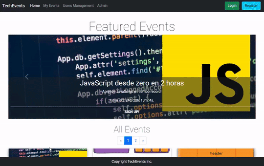
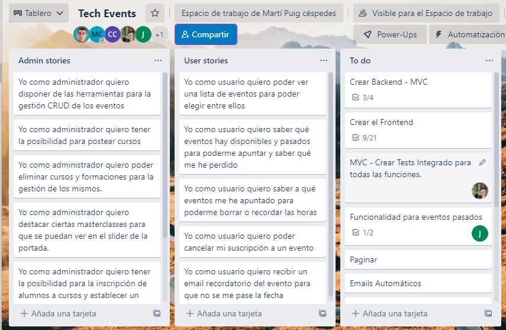
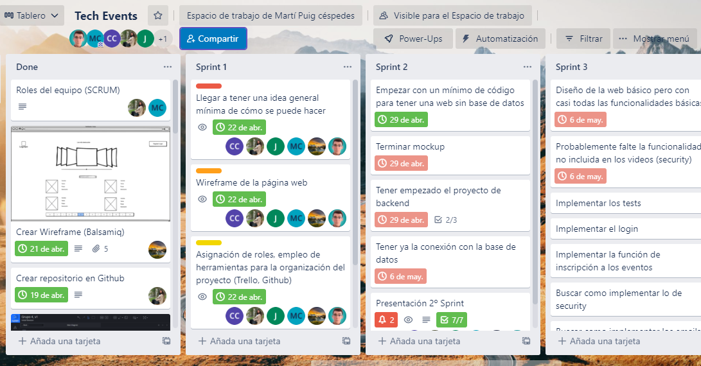

# TechEvents 🚀

This is our event management app. Admins can add/remove/edit events and users can subscribe/unsubscribe to attend them.

**Link to project:** https://github.com/Glauciagmm/TechEvents/

**Live Demo:** soon...

 

## How It's Made:
---

**Tech used 🛠️:** Java, Spring, Thymeleaf, HTML, CSS, JavaScript, Bootstrap, MariaDB

With Springboot to power our fullstack app, we made a responsive and modern looking system to manage events.

Our goal is to offer a flexible and dynamic learning environment for our customers, whether they are teachers or students.

This was our first time doing a fullstack app with Java and we managed to deliver in a short time.

 
 

## Team
---

Hi there!

We are a group of enthusiastic coders excited about web-designing. On our latest project we have created a web-page for an online web-developing academy.

- Carol: https://github.com/ayon79
- Glaucia: https://github.com/Glauciagmm
- Jesús: https://github.com/checkmyprojects
- Martí: https://github.com/Choephel108
- Pablo: https://github.com/pruizcas
- Patri: https://github.com/PMuin

## Optimizations
---

In order to deliver on time, we had to use javascript to do some little features such as the days/hours left or not allow to sign up if the even expired.

## Lessons Learned:
---

Springboot makes things much simpler and helps a lot.

We like thymeleaf! It's very powerfull and allows us to do a lot of cool stuff.

